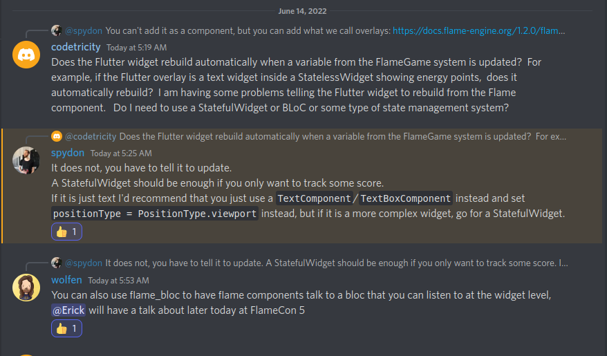
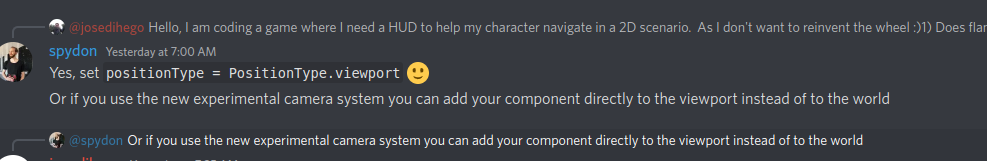

# Charlie Chicken

Basic sprite animation on Flutter with Flame.

Uses Flame joystick.

Add custom maps with Tiled and load into game with `flame_tiled`.

Collision and Removal

## Charlie Chicken Tutorials

* [Tutorial Playlist](https://youtube.com/playlist?list=PLxvyAnoL-vu4H9YM8on7AKNRMOsTOdIle)
* [1. Flutter Flame Introduction - Asset download, Setup, Basic SpriteComponent](https://youtu.be/k0EbDFZSqME)
* [2. Flutter Flame Sprite from Spritesheet](https://youtu.be/XAzgFAzODgs)
* [3. Flutter Flame Basic Sprite Movement and Spritesheet Use](https://youtu.be/ym6w-TqFbWk)
* [4. Flame SpriteAnimationComponent Introduction](https://youtu.be/josY45bVkvU)
* [5. Flame Virtual Joystick to Move Sprite Animation Component](https://youtu.be/YZX57R06kmM)
* [6. Build Game Maps for Flutter Flame with Tiled](https://youtu.be/69IYsckE-YQ)
* [7. flame_tiled Tutorial for Flutter Game Maps with Flame](https://youtu.be/RaJixqwtCh0)
* [8. Game World Bounds Detection with Flame and Flutter](https://youtu.be/kknJMhnKYNc)
* [9. Collision Layer in Tiled Map Editor for Flame Games](https://youtu.be/LXfAiI1EMxw)
* 10. Flame Sprite Collision and Removal

## Credits

* background - [Pixel Adventure by artist Pixel Frog](https://pixelfrog-assets.itch.io/pixel-adventure-1)
* chicken character = [Pixel Adventure 2 by artist Pixel Frog](https://pixelfrog-assets.itch.io/pixel-adventure-2)

## Development Environment

* Flame 1.2
* Flutter 3.0.2

## Development Notes

